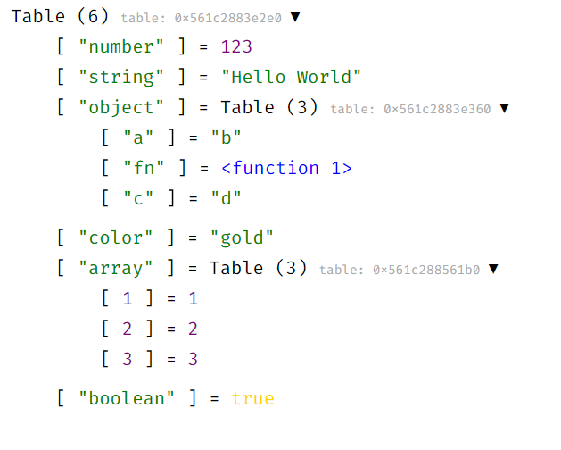

# Tableview

<a href="https://discord.gg/Y75ZXrD"></a> 


Tableview is a very small Lua module that lets you dump tables into HTML so you can inspect them on your web browser with syntax highlighting and collapsible tables.



## Install

You can install `tableview` via LuaRocks:

```sh
$ luarocks install tableview
```

## Usage

The module returns a table that contains a single function: `generate`. It takes a table and returns an HTML string.

You can also use the CLI utility that reads a Lua table from STDIN and outputs the HTML (installed as `tableview`).

## License

This project is Unlicensed.